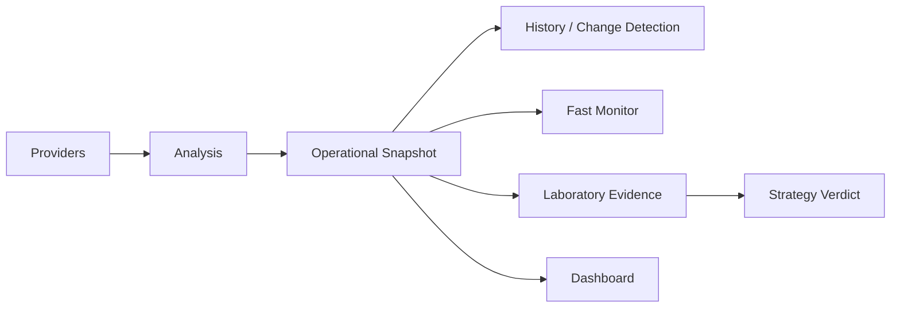

# Data Model & Persistence — Trading Engine v2

**Version:** 1.0 baseline

## 1. Persistence classes

The architecture uses several persistence/state concepts that must not be conflated:

1. **runtime market data** — provider responses/historical price data;
2. **operational state** — candidates, snapshots, changes and monitoring state;
3. **workflow cache** — GitHub Actions cache of the `data` directory across ephemeral runners;
4. **portfolio configuration/state** — existing positions/capital context;
5. **Laboratory evidence** — opportunities, paper positions, strategy results/verdict inputs;
6. **database/site state** — persistent records exposed through configured DB/dashboard components.

## 2. State responsibilities

Repository mapping identifies dedicated modules for database, history, snapshots and change-engine behaviour under `state/`, plus portfolio modules under `portfolio/`.

The exact table/schema catalogue must be kept aligned with executable schema/migration code. Where a table cannot be confirmed from repository code, documentation must mark it N/D rather than infer a schema from dashboard labels.

## 3. Data lifecycle

## 4. Data integrity principles

- timestamps should be timezone-aware/explicit at boundaries;
- provider freshness must be distinguishable from persisted observation time;
- writes should be idempotent where workflows can rerun;
- operational state and Laboratory evidence should have distinct authority;
- cache restoration must not masquerade as database durability;
- schema changes require versioning/migration documentation;
- no secret values belong in persisted documentation.

## 5. Database audit backlog

Before any major DB optimisation, document from code/schema:

`entity/table → key → writer → readers → retention → indexes → constraints → timestamp semantics → recovery/backfill`.

This remains an AS-IS audit task where repository schema details are not yet fully enumerated.