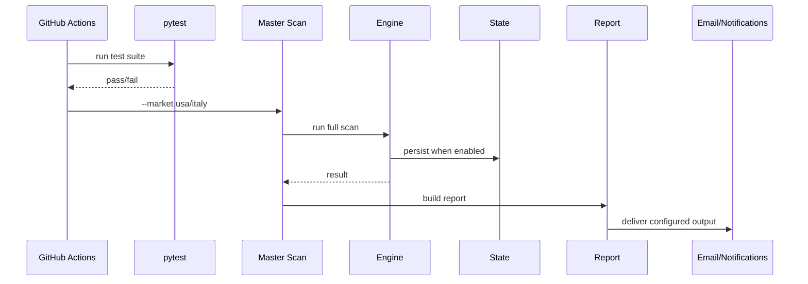

# Production Operations — Trading Engine v2

**Version:** 1.0  
**Baseline:** 26/08/2026

## 1. Production scope

Production includes the mechanisms that execute and expose the system rather than the trading logic alone:

- GitHub Actions workflows;
- runtime Python environment/dependencies;
- market schedules/manual dispatch;
- configuration/secrets/variables;
- data/state cache and persistence;
- email/WhatsApp delivery;
- dashboards/site;
- tests before operational execution;
- incident diagnosis and reruns.

## 2. Operational flows

### Master Scan

### Fast Monitor

Fast Monitor is executed independently from full discovery and uses existing relevant state/candidates. During validation an explicit WhatsApp test step was used to prove transport configuration independently from signal generation.

## 3. Runtime configuration

Documented names only; never values:

| Setting | Type | Purpose |
|---|---|---|
| `GMAIL_SENDER` | Secret | Sender account |
| `GMAIL_RECIPIENT` | Secret | Report recipient |
| `GMAIL_PASSWORD` | Secret | Gmail app credential/runtime auth |
| `WHATSAPP_NUMBER` | Secret | WhatsApp destination |
| `CALLMEBOT_APIKEY` | Secret | CallMeBot credential |
| `TRADING_CAPITAL` | Variable | Capital used by sizing/risk logic |
| `PORTFOLIO_POSITIONS_JSON` | Secret/config | Existing portfolio context |

Additional database/site credentials must be documented by name/purpose only when confirmed in workflow/config audit.

## 4. Workflow safety rules

- Test suite runs before operational scan where configured.
- A failed test prevents the scan step.
- Empty numeric environment variables must not be passed where reference code performs direct `float()` conversion.
- External provider failure must be distinguished from internal application regression.
- A green GitHub workflow does not by itself prove that a notification was delivered or that a strategy has statistical evidence.

## 5. State/cache

Actions cache is used for the `data` directory in relevant workflows. It preserves working state across ephemeral runners but must not be treated as a guaranteed database. Cache keys/restoration must avoid accidentally mixing incompatible state versions.

## 6. Notification validation

During current validation:

1. compare alert state to engine state;
2. verify current price/entry/Max Buy/stop/TP/RR where relevant;
3. verify transport delivery;
4. classify discrepancy as data, logic, presentation or delivery;
5. fix root cause, not merely alert wording;
6. add regression protection when practical.

## 7. Incident runbook

### Tests fail

- Do not bypass pytest to obtain a scan.
- Identify whether the failing test represents stale UI expectation or real behavioural regression.
- If stale test: update test to current documented behaviour.
- If behavioural regression: fix code and add/retain regression test.

### `TRADING_CAPITAL` conversion failure

- Check GitHub Variable value is numeric and non-empty.
- Check workflow fallback expression/environment mapping.
- Do not patch frozen reference solely to tolerate broken production configuration unless a deliberate cross-system policy change is approved.

### Workflow succeeds but WhatsApp not received

- Separate signal generation from transport validation.
- Verify `WHATSAPP_NUMBER` and `CALLMEBOT_APIKEY` presence without printing values.
- Run explicit transport test.
- Inspect notification client result/response.
- Only then debug Fast Monitor signal policy.

### Provider unavailable

- Classify recognised timeout/rate-limit/upstream-unavailable events as external.
- Fail closed: no invented data/decision.
- Mark parity run non-comparable where market snapshots cannot be aligned.

## 8. Schedules

Operational cron schedules must respect exchange trading days/hours and UTC/daylight-saving effects. Workflow YAML is the executable source of truth for exact cron expressions. Documentation should describe intent; when schedule changes, both must be updated.

## 9. Production maturity

Current governance treats Fast Monitor/alerts as validation/shadow until exit criteria in `FREEZE_BACKLOG.md` are met. Auto-trading remains disabled.

## 10. TO-BE production

Potential future improvements include durable event IDs, notification deduplication, explicit health metrics, provider telemetry, stronger state durability and shadow execution. Redis/queues are not part of AS-IS and remain conditional on measured need.