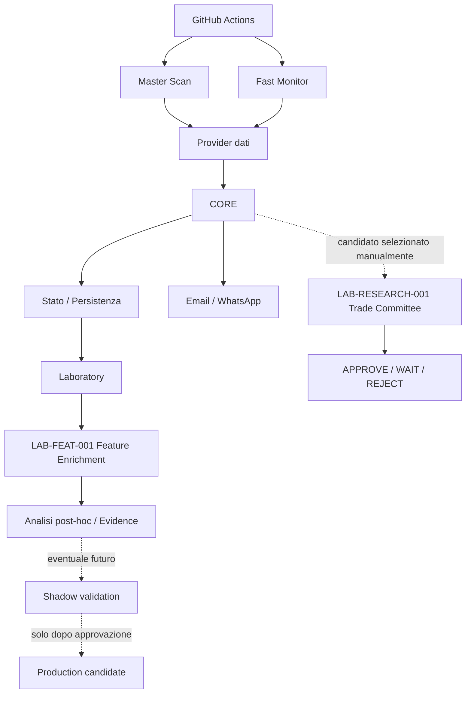
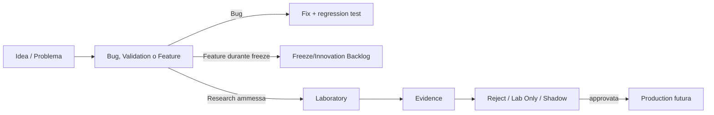

# Trading Engine v2 — Documentazione ufficiale

**Versione documentazione:** 1.3 ITA  
**Baseline tecnica:** 27/08/2026  
**Stato:** fotografia AS-IS + roadmap TO-BE + Laboratory research  
**Fonte primaria:** codice, configurazioni, test e documenti di governance versionati nel repository.

## Scopo

Questa cartella è la memoria funzionale e tecnica permanente di **Trading Engine v2**. Distingue sempre ciò che è Production, ciò che è ricerca Laboratory e ciò che è soltanto TO-BE.

## Mappa della documentazione

| Documento | Contenuto |
|---|---|
| [FUNCTIONAL_SPEC.md](FUNCTIONAL_SPEC.md) | Specifica funzionale e regole operative |
| [TECHNICAL_ARCHITECTURE.md](TECHNICAL_ARCHITECTURE.md) | Architettura tecnica reale |
| [SYSTEM_COMPONENTS.md](SYSTEM_COMPONENTS.md) | Catalogo componenti |
| [DATA_MODEL.md](DATA_MODEL.md) | Persistenza e modello dati |
| [PRODUCTION_OPERATIONS.md](PRODUCTION_OPERATIONS.md) | Workflow, schedulazioni, configurazioni e notifiche Production |
| [TESTING_AND_VALIDATION.md](TESTING_AND_VALIDATION.md) | Test, parity, evidence e gate |
| [LAB_FEATURE_ENRICHMENT.md](LAB_FEATURE_ENRICHMENT.md) | **LAB-FEAT-001**: raccolta passiva feature TradingView, research-only |
| [TRADE_COMMITTEE.md](TRADE_COMMITTEE.md) | **LAB-RESEARCH-001**: deep pre-trade check manuale, fonti, score, gate e UI V2 |
| [research/TRADE_COMMITTEE_SOURCE_RESEARCH.md](research/TRADE_COMMITTEE_SOURCE_RESEARCH.md) | Audit degli 8 video, fonti e architetture candidate |
| [research/TRADE_COMMITTEE_REUSE_MAP.md](research/TRADE_COMMITTEE_REUSE_MAP.md) | Mappa REUSE/ADAPT/BUILD dei repository open-source studiati |
| [BUG_FIX_REGISTER.md](BUG_FIX_REGISTER.md) | Bug, cause, fix e regressioni |
| [TECHNICAL_DEBT_AND_OPTIMIZATIONS.md](TECHNICAL_DEBT_AND_OPTIMIZATIONS.md) | Debito tecnico e ottimizzazioni candidate |
| [VERSION_HISTORY.md](VERSION_HISTORY.md) | Evoluzione sistema/documentazione |
| [architecture/AS_IS.md](architecture/AS_IS.md) | Architettura visuale implementata |
| [roadmap/TO_BE_ARCHITECTURE.md](roadmap/TO_BE_ARCHITECTURE.md) | Architettura futura proposta |
| [roadmap/INNOVATION_BACKLOG.md](roadmap/INNOVATION_BACKLOG.md) | Idee congelate/candidate, incluso `PROD-001` |
| [decisions/README.md](decisions/README.md) | Architecture Decision Record |

## Regola permanente

Ogni modifica significativa verifica l'impatto su **FUNCTIONAL, TECHNICAL, DATA MODEL, PRODUCTION, TESTING, BUG/FIX, ADR, ROADMAP** e aggiorna i documenti nello stesso ciclo del codice.

## Etichette

- **AS-IS VERIFIED** — confermato da codice/config/test.
- **LAB / RESEARCH ONLY** — può raccogliere evidence ma non modifica Production.
- **TO-BE** — proposta futura.
- **FROZEN** — modifica rinviata dalla Functional Freeze Governance.
- **N/D** — non confermato.

## Architettura generale

`LAB-FEAT-001` non è una nuova strategia: arricchisce passivamente i segnali già esistenti. `PROD-001`, cioè l'uso decisionale delle feature TradingView in Production, resta **FROZEN**.

`LAB-RESEARCH-001 Trade Committee` è un modulo manuale read-only: può contraddire il CORE ma non modifica segnali e non esegue ordini.

## CORE / LABORATORY / PRODUCTION

**CORE** decide: screening, scoring, entry, trigger, R/R, sizing e guardrail.  
**LABORATORY** misura: paper trading, evidence, varianti e feature candidate senza alterare il CORE.  
**PRODUCTION** esegue il sistema reale: workflow, provider, persistenza, notifiche e dashboard.  
**TRADE COMMITTEE** verifica manualmente un candidato prima dell'acquisto reale usando fonti e check indipendenti dal ranking CORE.

Un Laboratory tecnicamente sano non implica che una strategia sia statisticamente valida: `ENGINE HEALTH` e `STRATEGY EVIDENCE` restano concetti separati.

## AS-IS e TO-BE

Una proposta non diventa implementata perché è scritta bene. Redis, queue, auto-trading e `PROD-001` restano fuori dall'AS-IS finché non superano i gate previsti.

## Ciclo delle modifiche

