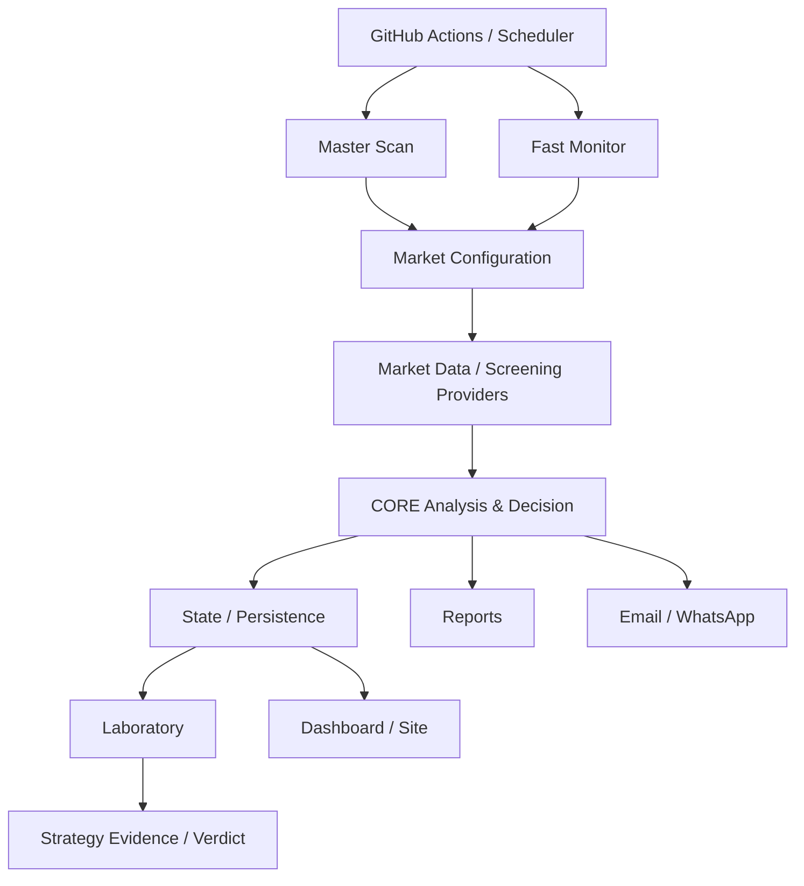

# Trading Engine v2 — Documentation Baseline

**Version:** 1.0  
**Baseline date:** 26/08/2026  
**Status:** AS-IS audit + TO-BE roadmap  
**Source of truth:** repository code, configuration, tests and versioned governance documents.

## Purpose

This directory is the permanent functional and technical memory of Trading Engine v2. It separates verified current behaviour from historical decisions, defects/fixes and future proposals.

## Documentation map

| Document | Purpose |
|---|---|
| [FUNCTIONAL_SPEC.md](FUNCTIONAL_SPEC.md) | What the system does, operational rules and user-visible behaviour |
| [TECHNICAL_ARCHITECTURE.md](TECHNICAL_ARCHITECTURE.md) | How the current system is implemented and connected |
| [SYSTEM_COMPONENTS.md](SYSTEM_COMPONENTS.md) | Component catalogue, responsibilities and dependencies |
| [DATA_MODEL.md](DATA_MODEL.md) | Persistence, files, state and database model |
| [PRODUCTION_OPERATIONS.md](PRODUCTION_OPERATIONS.md) | GitHub Actions, schedules, configuration, notifications and runbook |
| [TESTING_AND_VALIDATION.md](TESTING_AND_VALIDATION.md) | Tests, parity, Laboratory evidence and validation gates |
| [BUG_FIX_REGISTER.md](BUG_FIX_REGISTER.md) | Known defects, fixes, regression protection and impact |
| [TECHNICAL_DEBT_AND_OPTIMIZATIONS.md](TECHNICAL_DEBT_AND_OPTIMIZATIONS.md) | Code/DB/site/production optimisation candidates |
| [VERSION_HISTORY.md](VERSION_HISTORY.md) | Documentation and system evolution |
| [architecture/AS_IS.md](architecture/AS_IS.md) | Visual current architecture |
| [roadmap/TO_BE_ARCHITECTURE.md](roadmap/TO_BE_ARCHITECTURE.md) | Proposed future architecture, explicitly not current |
| [roadmap/INNOVATION_BACKLOG.md](roadmap/INNOVATION_BACKLOG.md) | Ideas and innovations not yet implemented |
| [decisions/README.md](decisions/README.md) | Architecture Decision Records (ADR) |

## Permanent rule

Every material system change must answer whether it changes: FUNCTIONAL, TECHNICAL, DATA MODEL, PRODUCTION, TESTING, BUG/FIX, ADR or ROADMAP documentation. Relevant documents should be updated in the same development cycle as the code.

## Truth labels

- **AS-IS VERIFIED** — confirmed in repository code/config/tests.
- **AS-IS DOCUMENTED** — existing project policy/documentation, not necessarily executable code.
- **TO-BE** — proposed future state; not implemented merely because it appears in documentation.
- **FROZEN** — intentionally deferred under Functional Freeze Governance.
- **N/D** — not confirmed by the repository audit yet.

## Architecture at a glance

This diagram is intentionally high-level. Detailed AS-IS diagrams are maintained under `docs/architecture/` and must be reconciled with the code during each documentation release.