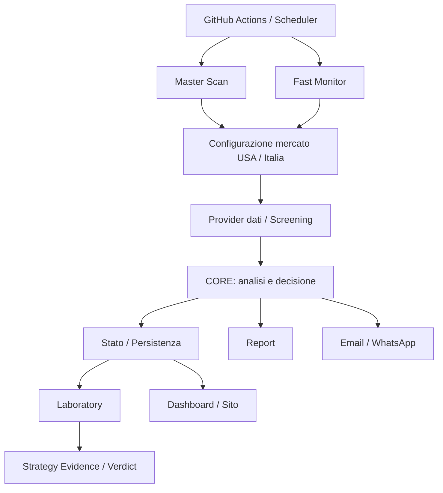
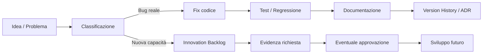

# Trading Engine v2 — Documentazione ufficiale

**Versione documentazione:** 1.1 ITA  
**Baseline tecnica:** 26/08/2026  
**Stato:** fotografia AS-IS + roadmap TO-BE  
**Fonte primaria:** codice, configurazioni, test e documenti di governance versionati nel repository.

## Scopo

Questa cartella costituisce la memoria funzionale e tecnica permanente di **Trading Engine v2**. Deve permettere di capire cosa fa il sistema oggi, come è costruito, perché sono state prese determinate decisioni, quali problemi sono stati corretti e quali evoluzioni sono soltanto proposte future.

I nomi reali di file, funzioni, classi, stati operativi e tecnologie restano in inglese quando fanno parte del codice. Le spiegazioni sono invece mantenute in italiano.

## Mappa della documentazione

| Documento | Contenuto |
|---|---|
| [FUNCTIONAL_SPEC.md](FUNCTIONAL_SPEC.md) | Specifica funzionale: comportamento del sistema, regole operative e risultati visibili all'utente |
| [TECHNICAL_ARCHITECTURE.md](TECHNICAL_ARCHITECTURE.md) | Architettura tecnica: implementazione reale, dipendenze e collegamenti tra componenti |
| [SYSTEM_COMPONENTS.md](SYSTEM_COMPONENTS.md) | Catalogo dei componenti con responsabilità, input/output e dipendenze |
| [DATA_MODEL.md](DATA_MODEL.md) | Persistenza, file di stato, database e modello dati |
| [PRODUCTION_OPERATIONS.md](PRODUCTION_OPERATIONS.md) | Production: GitHub Actions, schedulazioni, configurazioni, notifiche e runbook operativo |
| [TESTING_AND_VALIDATION.md](TESTING_AND_VALIDATION.md) | Test, parity OLD/NEW, Laboratory, evidence e gate di validazione |
| [BUG_FIX_REGISTER.md](BUG_FIX_REGISTER.md) | Registro storico di bug, cause, fix, impatto e protezione tramite test di regressione |
| [TECHNICAL_DEBT_AND_OPTIMIZATIONS.md](TECHNICAL_DEBT_AND_OPTIMIZATIONS.md) | Debito tecnico e possibili ottimizzazioni di codice, DB, sito, provider e Production |
| [VERSION_HISTORY.md](VERSION_HISTORY.md) | Evoluzione del sistema e della documentazione |
| [architecture/AS_IS.md](architecture/AS_IS.md) | Architettura visuale dello stato realmente implementato |
| [roadmap/TO_BE_ARCHITECTURE.md](roadmap/TO_BE_ARCHITECTURE.md) | Architettura futura proposta, esplicitamente distinta dall'AS-IS |
| [roadmap/INNOVATION_BACKLOG.md](roadmap/INNOVATION_BACKLOG.md) | Idee, innovazioni e miglioramenti non ancora implementati |
| [decisions/README.md](decisions/README.md) | Architecture Decision Record (ADR): decisioni e relativa motivazione |

## Regola permanente di manutenzione

Ogni modifica significativa al sistema deve verificare se impatta una o più aree: **FUNCTIONAL, TECHNICAL, DATA MODEL, PRODUCTION, TESTING, BUG/FIX, ADR, ROADMAP**.

I documenti interessati devono essere aggiornati nello stesso ciclo di sviluppo del codice. In questo modo la documentazione non diventa una fotografia vecchia mentre il software continua a cambiare, uno dei passatempi preferiti dei repository longevi.

## Etichette di attendibilità

- **AS-IS VERIFIED** — comportamento confermato direttamente da codice, configurazione o test del repository.
- **AS-IS DOCUMENTED** — regola o comportamento dichiarato nella documentazione di progetto ma non ancora verificato completamente nel codice.
- **TO-BE** — stato futuro proposto. Non è implementato solo perché compare in un documento.
- **FROZEN** — modifica intenzionalmente rinviata dalla Functional Freeze Governance.
- **N/D** — informazione non ancora confermata dall'audit del repository.

## Architettura generale

### Come leggere il diagramma

**GitHub Actions** avvia i processi schedulati o manuali. **Master Scan** effettua l'analisi ampia dell'universo previsto dalla configurazione, mentre **Fast Monitor** ricontrolla rapidamente candidati già rilevanti. I provider alimentano il **CORE**, che applica le regole decisionali e produce stato operativo, livelli e risultati. Gli esiti possono essere persistiti, trasformati in report e notificati via email/WhatsApp. Il **Laboratory** utilizza i dati raccolti per paper trading, evidence e verdict senza modificare silenziosamente il comportamento corrente del CORE.

## Tre domini principali

### CORE
È il dominio decisionale. Comprende discovery/screening, analisi, scoring, entry, trigger, risk/reward, sizing, guardrail e decisione operativa. Durante la fase PARITY parte del comportamento continua ad avere come oracle i moduli congelati in `reference/`.

### LABORATORY
È il dominio di ricerca e validazione. Osserva strategie e opportunità, apre paper position, raccoglie risultati e costruisce evidence. **Un Laboratory tecnicamente funzionante non rende automaticamente una strategia statisticamente valida.** Per questo la documentazione distingue sempre `ENGINE HEALTH` da `STRATEGY EVIDENCE`.

### PRODUCTION
È il dominio che fa funzionare realmente il sistema: workflow GitHub Actions, cron, configurazioni, Secrets/Variables, provider, persistenza, Supabase, cache/stato, notifiche, dashboard, test pre-run e gestione dei failure. La Production AS-IS deve essere documentata separatamente dalle eventuali evoluzioni TO-BE.

## AS-IS e TO-BE

La documentazione V1.1 mantiene una separazione obbligatoria:

- **AS-IS:** ciò che il repository fa realmente alla baseline corrente.
- **TO-BE:** ciò che potrebbe essere implementato in futuro dopo approvazione e relativi gate.

Redis, message queue, auto-trading, nuove strategie o altre innovazioni non devono comparire nei diagrammi AS-IS finché non sono effettivamente implementati.

## Ciclo documentale delle modifiche

Questa catena serve a conservare non soltanto **cosa** è stato cambiato, ma anche **perché**, con quale evidenza e in quale versione.