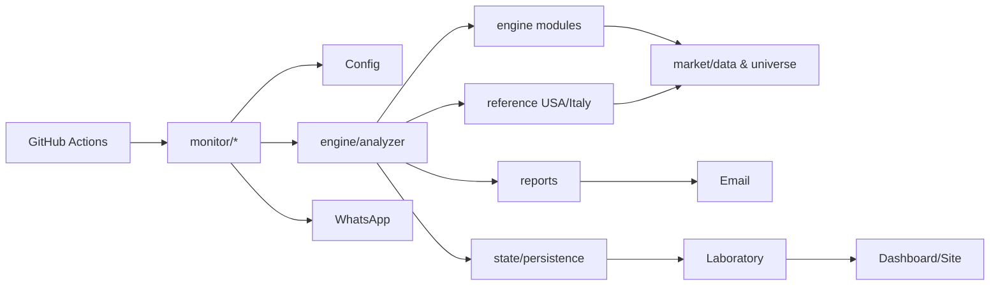

# Technical Architecture — Trading Engine v2

**Version:** 1.0  
**Baseline:** 26/08/2026  
**Rule:** AS-IS statements must be supported by repository code/config/tests. Future components are labelled TO-BE.

## 1. Architectural style

Trading Engine v2 is a Python-based modularisation of two frozen market reference engines, orchestrated primarily through GitHub Actions. The repository currently combines:

- frozen reference baselines (`reference/`);
- modular engine surfaces (`engine/`);
- market/configuration layers;
- monitoring entry points (`monitor/`);
- persistence/state;
- notifications/reporting;
- Laboratory research and dashboard surfaces;
- automated tests and parity controls.

The important technical debt is that modularisation is not equivalent to complete independence: parts of v2 still bind/delegate to the frozen reference implementations. This is intentional during parity-first migration but must not be mistaken for the final architecture.

## 2. High-level AS-IS

## 3. Reference baselines

The repository freezes USA and Italy reference implementations and protects their integrity with SHA-256/test controls. `FUNCTION_MAP.csv` maps top-level reference responsibilities toward modular destinations. The reference layer is therefore both:

- the behavioural oracle for Phase A parity;
- temporary technical debt until modular extraction is complete.

Changing frozen reference code to make v2 appear correct would defeat parity-first migration and is prohibited by governance.

## 4. Engine layer

The engine layer contains modular concerns such as scoring, entry construction, risk/reward, sizing, triggers, pre-buy, decision normalisation, anomaly/data sanitation, value-trap handling and shared utilities.

The analyzer/orchestrator is responsible for assembling configuration, reference behaviour, data and operational output. Market-specific post-processing must be explicit to prevent Italian semantics from contaminating USA decisions and vice versa.

## 5. Market/data layer

External market information is primarily obtained through Python dependencies including `yfinance` and `tradingview-screener`. Benchmark history is passed to relative-strength calculations rather than assumed globally.

Expected benchmark semantics:

- USA: SPY
- Italy: FTSE MIB-compatible symbol configured by the implementation

Provider failure must fail safely. Missing benchmark information should become N/D/unknown rather than inventing relative strength.

## 6. State and persistence

The repository contains dedicated state/history/snapshot/change-engine responsibilities. GitHub Actions also restores/saves the `data` directory through Actions cache in operational workflows. Cache is an execution convenience, not a substitute for a transactional database.

Where Supabase/database-backed Laboratory or site state is configured, its schema and authoritative responsibilities are documented separately in `DATA_MODEL.md`; secrets/credentials are never stored in documentation.

## 7. Reports and notifications

Reporting binds market-specific reference/report behaviour to modular execution. Email is generated from scan output; WhatsApp uses a notification client and CallMeBot configuration for operational messages.

A key invariant is that presentation must not contradict decision state. Notification/report discrepancies are classified as internal defects for parity/validation purposes.

## 8. Laboratory boundary

Laboratory consumes/persists observations for evidence generation, paper positions, strategy maturity and verdicts. It must remain logically separated from direct live decision mutation. Research results may justify a future versioned policy change, but must not silently feed back into current CORE thresholds.

## 9. Production boundary

Production consists of the executable GitHub workflows, runtime configuration, provider access, persistence, notification delivery and operational dashboards. Production documentation is in `PRODUCTION_OPERATIONS.md`.

## 10. Security/configuration

Runtime secrets/variables include, depending on workflow:

- Gmail sender/recipient/password;
- WhatsApp number;
- CallMeBot API key;
- trading capital;
- portfolio position JSON;
- database/service credentials where configured.

Only names and purpose belong in documentation. Values must remain in GitHub Secrets/Variables or the appropriate secure runtime store.

## 11. Known architecture debt

1. Reference wrappers/delegation remain part of the CORE migration path.
2. Provider reliability/freshness needs explicit observability before higher automation.
3. Advanced portfolio statistics require larger samples.
4. Redis/message queues are not justified without measured bottlenecks.
5. Semi/auto execution remains disabled pending maturity gates.

## 12. TO-BE architecture principles

TO-BE is maintained separately under `docs/roadmap/TO_BE_ARCHITECTURE.md`. The desired direction is a genuinely modular CORE with explicit provider interfaces, decision contracts, durable state, observability and independently testable notification/execution boundaries. Infrastructure is introduced only when measured requirements justify it.