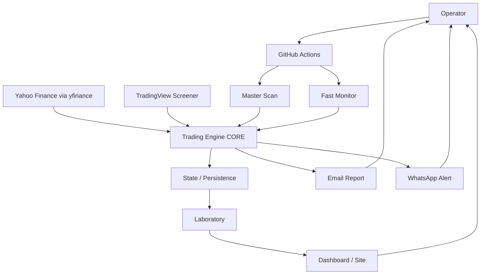
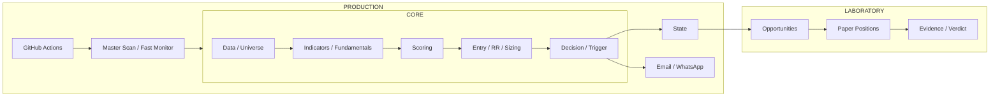
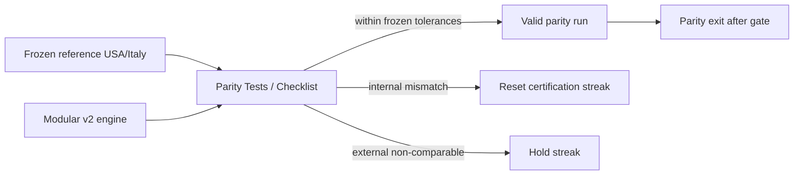

# AS-IS Architecture Diagrams

**Baseline:** 26/08/2026

## System context

## Logical separation

## Parity migration

## Important AS-IS caveat

The modular v2 surface still uses/binds parts of the frozen reference implementation. The diagrams therefore describe logical responsibilities, not a claim that every box is already physically independent Python code.