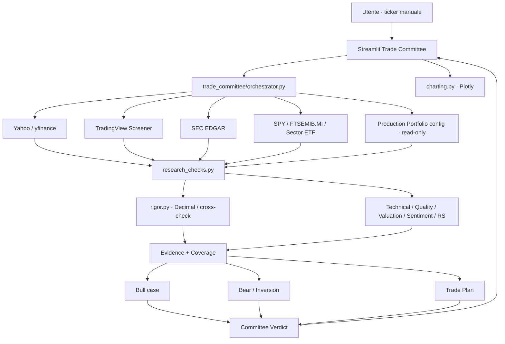

# Architettura tecnica · Trade Committee V2

**Modulo:** `LAB-RESEARCH-001`  
**Stato:** RESEARCH ONLY / manuale / read-only verso Production  
**Versione:** V2 · 27/08/2026

## Obiettivo architetturale

Il Trade Committee è un modulo separato dal CORE. Riceve un ticker scelto manualmente, raccoglie evidenze da più fonti, esegue check deterministici e produce un verdetto aggiuntivo `APPROVE / WAIT / REJECT`.

Non scrive segnali Production, non modifica score CORE e non esegue ordini.



## Componenti

### `trade_committee/orchestrator.py`
Responsabilità:
- sequenziare i 12 check;
- registrare la copertura reale per check;
- calcolare Data Confidence;
- costruire Bull/Bear/Inversion;
- applicare gate;
- calcolare Committee Score;
- produrre il payload finale.

### `trade_committee/research_checks.py`
Responsabilità:
- adapter Yahoo/yfinance;
- indicatori tecnici;
- fondamentali;
- quality/valuation;
- earnings;
- news/analyst/insider/institutional;
- SEC EDGAR;
- benchmark e relative strength;
- TradingView cross-check;
- portfolio context;
- trade plan.

Ogni adapter deve fallire in modo degradato: un provider indisponibile genera `PARTIAL/N-D`, non un dato fittizio.

### `trade_committee/rigor.py`
Responsabilità:
- calcoli finanziari con `Decimal`;
- market-cap consistency check;
- P/E consistency check;
- cross validation di valori provenienti da fonti diverse.

Pattern ispirato al financial-rigor toolkit di AI Berkshire, riscritto per il progetto.

### `trade_committee/charting.py`
Responsabilità esclusivamente visuale:
- candlestick;
- SMA20/50/200;
- volume;
- livelli Entry/Stop/TP1/TP2.

Non contribuisce a score o verdict.

### `pages/5_Trade_Committee.py`
Responsabilità:
- input ticker;
- progress live;
- snapshot decisionale;
- grafico;
- piano operativo;
- Bull/Bear;
- tabella coverage/source;
- tab di approfondimento.

Il precedente Run Log persistente non è più parte dell'esperienza V2.

## Data flow

```text
Ticker
  -> Yahoo market history/info
  -> TradingView secondary cross-check
  -> SEC official filings
  -> Benchmark/sector context
  -> Portfolio snapshot
  -> deterministic checks
  -> coverage/source matrix
  -> score + gates
  -> Bull/Bear/Inversion
  -> trade plan
  -> APPROVE / WAIT / REJECT
```

## Coverage model

Ogni check restituisce:

```text
step
check
status = REAL | PARTIAL | N/A | N/D
source
note
```

`Data Confidence` non misura la bontà del titolo. Misura quanto è completa la base informativa disponibile per quel run.

## Gate

La V2 impedisce `APPROVE` quando:
- `Price < SMA50 < SMA200`;
- earnings entro 7 giorni;
- Data Confidence <70%;
- R/R netto TP1 <1.5.

Ulteriori gate potranno essere aggiunti solo dopo test e documentazione.

## Sicurezza e isolamento

- nessuna credenziale broker;
- nessun endpoint di execution;
- nessuna scrittura su segnali Production;
- SEC accesso read-only;
- portfolio letto da configurazione locale versionata;
- timeout/provider failure degradano la confidence;
- nessun dato mancante viene inferito come fatto.

## Dipendenze

- `streamlit`
- `yfinance`
- `pandas`
- `numpy`
- `tradingview-screener`
- `plotly`
- Python stdlib `urllib`, `decimal`, `json`

## Debito tecnico residuo

- Company IR adapter;
- transcript/guidance extraction;
- 13F manager-level adapter;
- web/news multi-provider;
- business moat/management qualitative research;
- portfolio sector concentration live;
- Candidate Queue Engine -> Committee.
