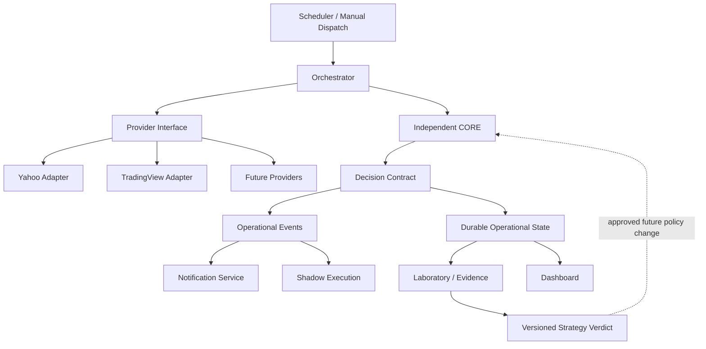

# TO-BE Architecture — Trading Engine v2

**Version:** 1.0 proposal  
**Important:** nothing in this document is AS-IS unless separately promoted and documented.

## Target principles

1. CORE independent from frozen reference modules after controlled parity extraction.
2. Explicit provider interfaces and freshness/error contracts.
3. Durable, versioned state model with clear authority between operational and Laboratory data.
4. Observable production: run IDs, data freshness, provider status, decision trace, notification status.
5. Research/AI isolated from operational decision mutation until evidence gates pass.
6. Shadow execution before semi-automatic execution.
7. Infrastructure complexity only when justified by measured requirements.

## Conceptual target

The dotted feedback path is governance-controlled and versioned, never an automatic self-learning loop.

## Conditional components

### Redis
Not target by default. Introduce only after measured caching/latency need.

### Message queue/event bus
Not target by default. Introduce only if scheduler/direct event handling demonstrates reliability, throughput or decoupling limits.

### Advanced portfolio optimiser
Only after adequate position history makes correlations/estimates defensible.

### AI/TradingAgents
Remain Laboratory-only until predefined OOS A/B tests show repeatable benefit.

### Semi-auto execution
Requires independent CORE, validated alerts, durable state, failure handling, shadow evidence and explicit risk controls.

## Migration order

`PARITY → VALIDATED CORE → modular extraction → evidence building → production observability → shadow execution → possible semi-auto`

No calendar date alone advances this sequence.